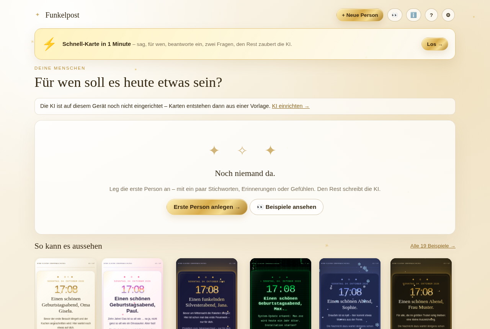
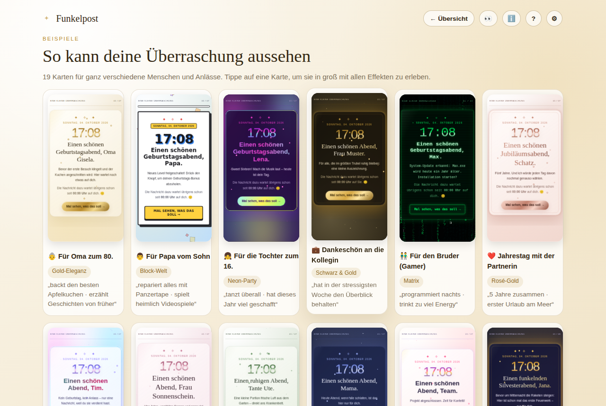
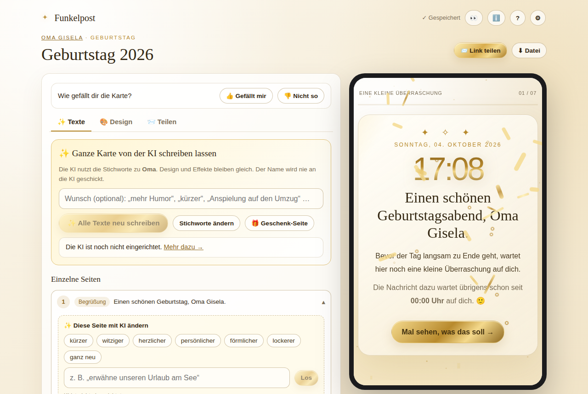
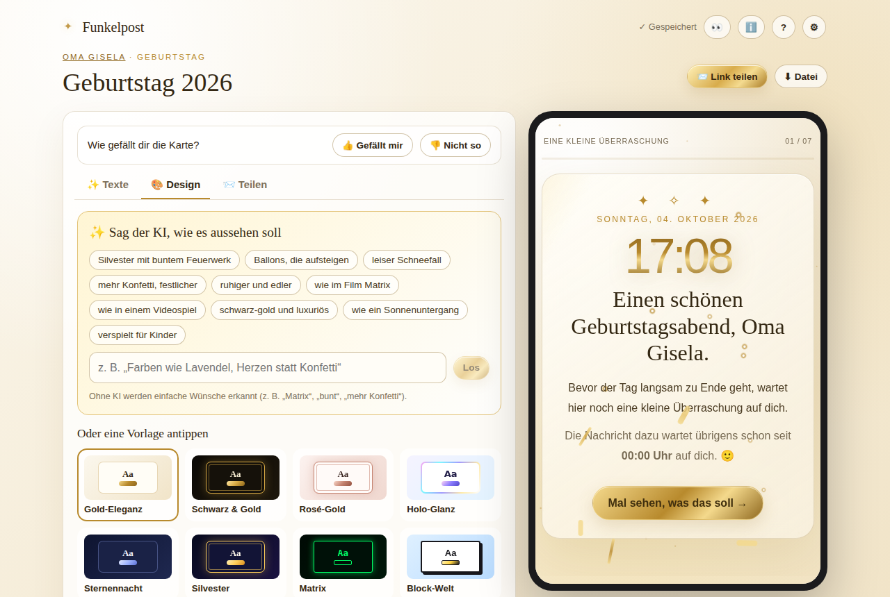
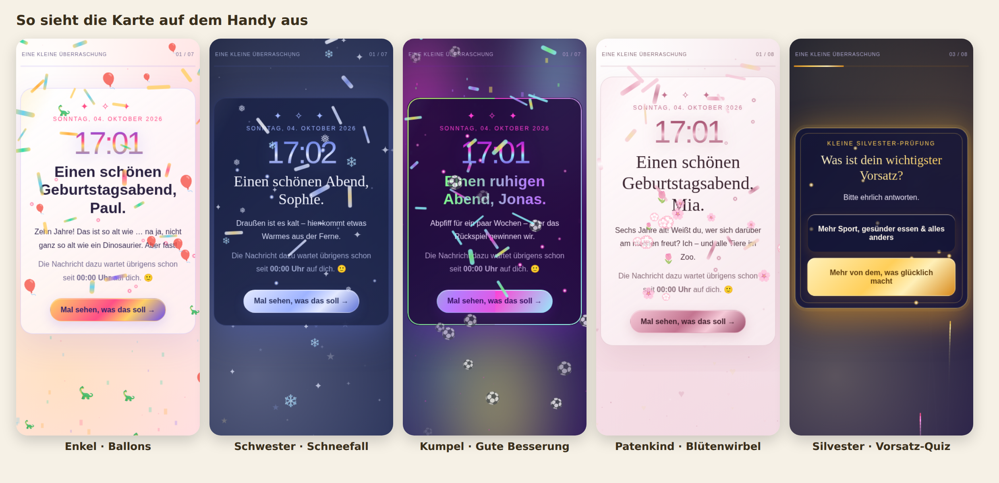
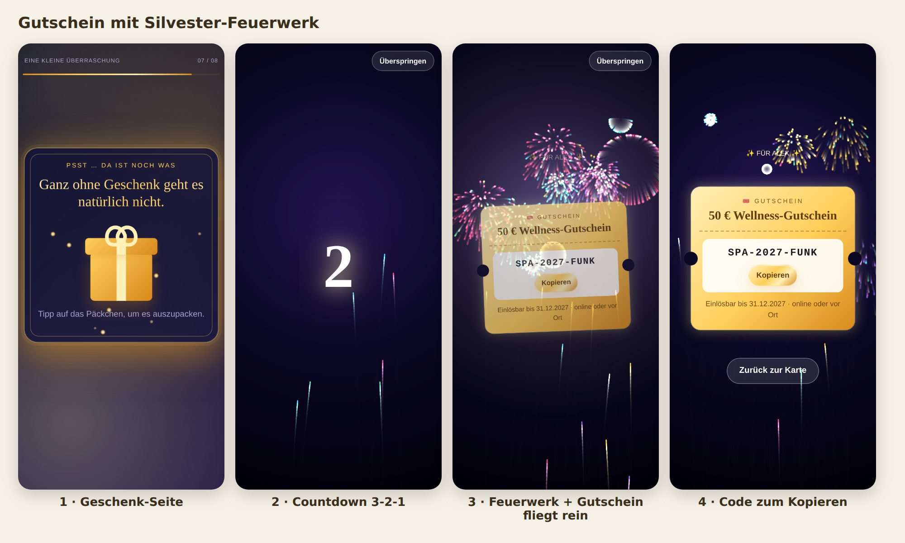
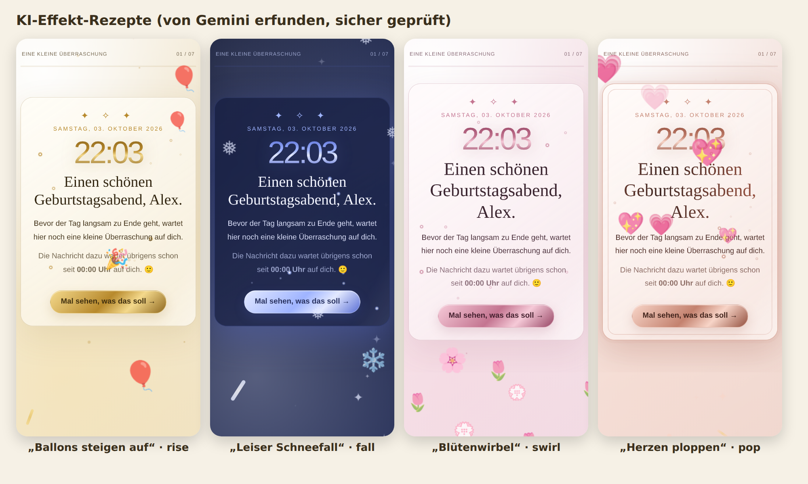

# ✦ Funkelpost – persönliche Überraschungen, mit KI gezaubert

Funkelpost macht aus ein paar Stichworten eine animierte, interaktive Überraschungskarte – für Familie,
Freunde, Kolleginnen und Kollegen. Statt fertiger Texte gibst du **Situationen, Gefühle und
Kleinigkeiten** ein; die KI macht daraus eine kleine Geschichte in sieben Seiten:

1. **Begrüßung** – passt sich der Tageszeit an, mit Live-Uhr
2. **Kurzer Hinweis** – augenzwinkernd
3. **Quiz** – eine „fachliche Prüfung“ mit Sonderregelung
4. **Liste** – „Für heute offiziell gestrichen“
5. **Der ehrliche Teil** – hier zählen deine Stichworte am meisten
6. **Schein-Ende** – „Protokoll erfolgreich abgeschlossen“ …
7. **Finale** – Wunsch, Signatur (auf Wunsch **handschriftlich**, wie mit Tinte nachgezeichnet) und ein **Kino-Finale**

Dazu auf Wunsch eine kleine **Hintergrundmelodie** (Spieluhr, festlich oder ruhig) – im Browser erzeugt,
ohne Audiodateien.

## So sieht es aus

**Live ausprobieren:** https://makandev.github.io/Bdgen/

| Startseite | Beispiel-Galerie |
|---|---|
|  |  |
| **Editor mit Live-Vorschau** | **Design per Wunsch oder Vorlage** |
|  |  |

**Auf dem Handy der beschenkten Person** – mit Effekten, die die KI selbst erfinden kann:



**Gutschein mit Silvester-Feuerwerk** – Countdown, Feuerwerk, dann fliegt der Gutschein herein:



**KI-Effekt-Rezepte** – Ballons, Schneefall, Blütenwirbel, Herzen:



## Was drin ist

**13 Designs:** Gold-Eleganz · Schwarz & Gold · Rosé-Gold · Holo-Glanz · Sternennacht · Silvester · Matrix (mit Zeichenregen) ·
Block-Welt (Roblox-Stil) · Neon-Party · Rosé-Pastell · Bunte Party · Salbei & Natur · Schlicht – dazu fünf Kartenstile,
sechs Hintergrund-Effekte (inkl. Feuerwerk), Konfetti als Streifen, Herzen, Sterne, Quadrate oder Zeichen und
**KI-Effekt-Rezepte** (die KI erfindet z. B. aufsteigende Ballons oder Schneefall – geprüft und mit eigenem Code gezeichnet). Alles per KI-Wunsch
änderbar („wie in einem Videospiel“, „schwarz-gold und luxuriös“) – selbst schreiben ist optional.

In der App: **👀 Beispiele** (19 fertige Karten zum Anschauen) und **ℹ️ Infos** (Neuigkeiten, Pläne, KI-Leitfaden).

**Außerdem:**

- **⚡ Schnell-Karte:** Name, Beziehung, ein bis zwei passende Fragen mit Antwort-Ideen – die KI macht den Rest und wählt ein passendes Design.
- **🎁 Geschenk-Seite:** ein Päckchen, das beim Antippen aufgeht und das Geschenk zeigt.
- **🎟️ Gutschein mit Feuerwerk:** optional ein Gutschein als Code (mit Kopieren-Knopf), Foto oder PDF – nach Countdown und Feuerwerk-Show fliegt er herein. Die KI sieht Gutscheine nie.
- **📲 Als App installieren:** Knopf unten rechts mit passender Anleitung für iPhone/iPad (Safari, Chrome), Android, Mac und PC.
- **Ältere iPhones:** Die Empfänger-Ansicht ist ein eigenes, kleines Skript (ohne Next.js) und läuft ab iOS 11.
- **💌 Reaktionen:** Am Ende antwortet die beschenkte Person mit Knöpfen, die zur Situation passen (❤️, 😂, 🥂, 💪 …). In der Server-Version kommt die Reaktion samt kurzer Nachricht direkt beim Absender an, in der Browser-Version per WhatsApp/Teilen.
- **👍 / 👎 und Lernen:** Bei 👎 nennt man den Grund, und die KI bekommt bis zu zwei weitere Versuche. Aus allen Bewertungen lernt Funkelpost: beliebte Designs werden zuerst vorgeschlagen, von zwei Schreibstilen setzt sich der besser bewertete durch, gelungene Formulierungen (ohne Namen) dienen als Vorbild. Gespeichert werden nur Merkmale, nie Namen oder Stichworte.

## Zwei Versionen – eine Codebasis

| | **Browser-Version** (GitHub Pages) | **Server-Version** (eigener Server) |
|---|---|---|
| Daten | im Browser des jeweiligen Geräts | zentral in SQLite – auf jedem Gerät dieselben Personen & Karten |
| KI-Schlüssel | nur auf dem eigenen Gerät (optional mit Geräte-Passwort verschlüsselt) | nur auf dem Server, nie im Browser |
| Passwort | optional: Geräte-Passwort für die KI-Schlüssel | Login mit Session-Cookie (30 Tage), Schutz gegen Durchprobieren |
| Link teilen | Karte steckt im Link (`/k/#…`) | kurzer Link `/k/abc123/` – abschaltbar, Änderungen sofort sichtbar |
| Bauen | `npm run build` (automatisch per GitHub Actions) | `npm run build:server` bzw. Docker |

Oberfläche, Karten, Vorlagen und KI-Prompts sind identisch. Eine Sicherung aus der Browser-Version
lässt sich in die Server-Version einspielen (⚙ Einstellungen → Sicherung).

## Server-Version installieren

```bash
git clone https://github.com/makandev/Bdgen.git funkelpost && cd funkelpost
./install.sh
```

Das Skript installiert bei Bedarf Docker, fragt Passwort, KI-Schlüssel und (optional) eine Domain ab,
richtet bei Domain automatisch HTTPS ein und startet alles. Danach: `./update.sh` zum Aktualisieren,
`./backup.sh` für Sicherungen. **Ausführliche Anleitung für Einsteiger: [docs/SERVER.md](docs/SERVER.md)**
(inkl. Heimnetz, Raspberry Pi, ohne Docker, Fehlerbehebung).

| Variable | Pflicht | Bedeutung |
|---|---|---|
| `APP_PASSWORD` | ja | Passwort für die App |
| `AUTH_SECRET` | empfohlen | Zufallswert zum Signieren der Anmeldung |
| `GEMINI_API_KEY` / `OPENROUTER_API_KEY` | mind. einer | KI-Schlüssel |
| `GEMINI_MODEL`, `OPENROUTER_MODEL`, `AI_PROVIDER` | nein | Modellwahl / Reihenfolge |
| `DATABASE_PATH` | nein | Standard `./data/funkelpost.db` |
| `COOKIE_SECURE` | nein | `false`, wenn ohne HTTPS (Heimnetz) betrieben |
| `NEXT_PUBLIC_BASE_PATH` | nein | falls unter einem Unterpfad betrieben (beim Bauen setzen) |

## Browser-Version: so funktioniert’s

| | |
|---|---|
| **Speicher** | Personen und Karten liegen nur im Browser des jeweiligen Geräts. Unter ⚙ Einstellungen gibt es eine Sicherung zum Herunterladen/Einspielen (auch zum Übertragen auf ein anderes Gerät). |
| **Teilen** | Die ganze Karte steckt im Link (hinter dem `#`) – sie wird nirgends hochgeladen. Empfänger brauchen kein Passwort. Alternativ: Karte als einzelne HTML-Datei, die offline funktioniert. |
| **KI** | Google Gemini oder OpenRouter (beide mit Gratis-Modellen). Ist einer ausgelastet, wird automatisch der andere versucht. Ohne KI entstehen Karten aus Vorlagen. |
| **Datenschutz** | Der Name der Person wird **nie** an die KI geschickt – sie arbeitet mit dem Platzhalter `{{name}}`. |
| **Sicherheit** | Geteilte Karten laufen in einer abgeschotteten Umgebung (Sandbox) und können nicht auf gespeicherte Daten oder Schlüssel zugreifen. Alle Inhalte aus Links werden geprüft und bereinigt. |

## Browser-Version: KI-Schlüssel – nur auf dem eigenen Gerät

Jede Person trägt unter **⚙ Einstellungen** ihren **eigenen** kostenlosen Schlüssel ein
(Gemini: https://aistudio.google.com/apikey · OpenRouter: https://openrouter.ai/keys).

- Der Schlüssel bleibt **nur auf diesem Gerät** und geht direkt an Google bzw. OpenRouter.
  Er landet **nie** auf GitHub, in der veröffentlichten Webseite oder in einem Link.
- **Empfohlen:** „🔒 Schlüssel mit Passwort schützen“. Dann liegt der Schlüssel nur verschlüsselt
  (AES-256-GCM, PBKDF2 mit 600 000 Runden) auf dem Gerät. Nach dem Öffnen der App fragt sie einmal
  nach dem Geräte-Passwort; entschlüsselt liegt er nur, solange der Tab bzw. die App offen ist.
- Der Veröffentlichungs-Workflow bekommt absichtlich **keine** Secrets und bricht ab, falls im Build
  etwas steht, das wie ein KI-Schlüssel aussieht. Alte Secrets `GEMINI_API_KEY`, `OPENROUTER_API_KEY`
  und `BDGEN_PASSWORD` werden nicht mehr gebraucht und können gelöscht werden.

Dauerhaft und für alle Geräte gemeinsam geht es mit der **Server-Version**: Dort stehen die Schlüssel
in der `.env` auf deinem eigenen Server.

Optional als *Variables* (nicht Secrets): `GEMINI_MODEL`, `OPENROUTER_MODEL`, `AI_PROVIDER` (`gemini`/`openrouter`).

> Hinweis: Die Webseite selbst (HTML/JavaScript) ist wie jede Webseite öffentlich abrufbar – sie enthält
> aber weder Schlüssel noch persönliche Daten. Personen und Karten liegen nur auf deinem Gerät.

## Browser-Version veröffentlichen

Jeder Push auf `main` prüft beide Versionen, führt die Tests aus und veröffentlicht die Browser-Version automatisch
(`.github/workflows/pages.yml`). Adresse: `https://<benutzer>.github.io/<repository>/`

Voraussetzung (einmalig): **Settings → Pages → Source: „GitHub Actions“**.

## Entwickeln

```bash
npm install
npm run dev          # Browser-Version, http://localhost:3000
npm run dev:server   # Server-Version (braucht .env)
npm test             # Unit-Tests
npm run typecheck
npm run build        # Browser-Version → ./out
npm run build:server # Server-Version → .next
```

## Für Entwickler:innen

Das vollständige **Entwickler-Handbuch** (Architektur, Datenmodell, Renderer, KI, Sicherheit, Tests,
Rezepte, Stolperfallen, Dateiverzeichnis) liegt in [`docs/handbuch/`](docs/handbuch/README.md).
Arbeitsregeln für KI-Assistenten: [`CLAUDE.md`](CLAUDE.md).

Texte unterstützen `{{name}}` (Anrede), `**fett**`, `*betont*` und Zeilenumbrüche.
