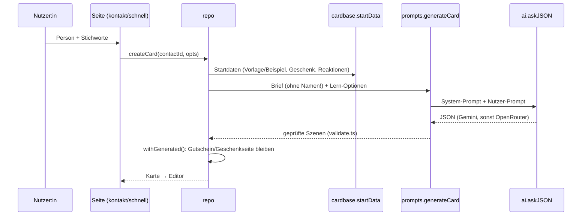

# 2 · Architektur

## Zwei Versionen aus einer Codebasis

| | Browser-Version | Server-Version |
|---|---|---|
| Bauen | `npm run build` → statischer Export nach `out/` | `npm run build:server` (`NEXT_PUBLIC_MODE=server`) |
| Hosting | GitHub Pages (Unterordner `/Bdgen`) | eigener Server, Docker oder systemd |
| Daten | `localStorage` des Geräts (`src/lib/store.ts`) | SQLite (`src/server/db.ts`) |
| KI-Schlüssel | nur auf dem Gerät, optional verschlüsselt (`src/lib/settings.ts`) | `.env` auf dem Server |
| Zugang | optional Geräte-Passwort (`src/components/Gate.tsx`) | Login + Session-Cookie (`src/proxy.server.ts`) |
| Karten-Link | Karte steckt komprimiert im Link: `/k/#…` | kurzer Link `/k/<slug>/`, abschaltbar |

**Technik:** Next.js 16 (App Router, Turbopack), React 19, TypeScript. Keine UI-Bibliothek, eigenes CSS
(`src/app/globals.css`). Laufzeit-Abhängigkeiten nur `next`, `react`, `react-dom`, `fflate`.

### Wie die Weiche funktioniert

1. **`pageExtensions`** in `next.config.ts`: Dateien mit der Endung `.server.ts` (API-Routen, Proxy,
   `/k/[slug]`) gibt es nur im Server-Build. Im statischen Export wären sie nicht erlaubt.
2. **`src/lib/repo.ts`** definiert die Schnittstelle `Repo` (Personen, Karten, KI, Sicherung, Bewertungen,
   Reaktionen). Es gibt zwei Umsetzungen: `browserRepo` (lokal, KI direkt aus dem Browser) und
   `serverRepo` (ruft `/api/…` auf). `repo` ist je nach `SERVER` die eine oder andere.
   **Seiten sprechen nur mit `repo`** – nie direkt mit `store.ts` oder `fetch`.
3. Gemeinsame Logik (z. B. Startdaten einer Karte, Übernahme von KI-Ergebnissen) liegt in
   `src/lib/cardbase.ts` und wird von beiden Seiten benutzt.

## Ordner

```
src/app/(app)/        Seiten der App (Übersicht, Person, Editor, Schnell-Karte, Beispiele, Infos, Einstellungen)
                      – alle hinter <Gate> (Layout in (app)/layout.tsx)
src/app/login/        Login (nur Server-Version sinnvoll)
src/app/start/        Weiterleitung von einer alten Adresse
src/app/api/          API-Routen der Server-Version (*.server.ts)
src/app/k/[slug]/     Empfänger-Ansicht der Server-Version
src/components/       Bausteine der Oberfläche
src/lib/              Kernlogik, läuft in Browser und Server
src/server/           Nur Server: Datenbank, Session, Limits, Hilfen
scripts/              Build-Helfer und die eigenständige Empfänger-Ansicht (viewer/)
tests/                Unit-Tests (node --test über tsx)
deploy/, *.sh         Server-Betrieb (Caddy, systemd, Installer)
```

## Datenfluss beim Erstellen einer Karte



## Empfänger-Ansicht

- **Browser-Version:** `public/k/index.html` wird vor jedem Build aus `scripts/viewer/` gebaut
  (`scripts/prepare-public.mjs`, esbuild, Ziel ES2017). Sie liest den Link-Anhang (`#…`), prüft ihn
  (`share.ts` → `validate.ts`), erzeugt das HTML (`render.ts`) und zeigt es in einem
  **abgeschotteten iframe** (`sandbox` ohne `allow-same-origin`). Bewusst **ohne Next.js/React**,
  damit auch alte iPhones die Karte öffnen.
- **Server-Version:** `src/app/k/[slug]/route.server.ts` liefert das fertige HTML direkt aus,
  mit Adresse für Reaktionen (`/api/react/<slug>`).

## Seiten-Adressen

| Pfad | Datei | Zweck |
|---|---|---|
| `/` | `src/app/(app)/page.tsx` | Übersicht: Erinnerungen (≤ 7 Tage), Personen, Schnell-Karte, Beispiel-Vorschauen, Funkeln |
| `/kontakt/?id=…` | `src/app/(app)/kontakt/page.tsx` | Person anlegen/bearbeiten, Karte erstellen |
| `/karte/?id=…` | `src/app/(app)/karte/page.tsx` | Editor (Texte, Design, Teilen), Autosave |
| `/schnell/` | `src/app/(app)/schnell/page.tsx` | Schnell-Karte mit zwei Fragen |
| `/beispiele/` | `src/app/(app)/beispiele/page.tsx` | Galerie (`?zeige=<id>` öffnet direkt) |
| `/infos/` | `src/app/(app)/infos/page.tsx` | Neuigkeiten, Pläne, KI-Leitfaden |
| `/einstellungen/` | `src/app/(app)/einstellungen/page.tsx` | KI-Schlüssel, Geräte-Passwort, Sicherung, Lernen, Installieren |
| `/login/` | `src/app/login/page.tsx` | Server-Login |
| `/k/#…` | `scripts/viewer/` → `public/k/index.html` | Empfänger (Browser-Version) |
| `/k/<slug>/` | `src/app/k/[slug]/route.server.ts` | Empfänger (Server-Version) |

Hinweis: Adressen enden immer mit `/` (`trailingSlash: true`), und im Code steht der Pfad **ohne**
`/Bdgen` – den Unterordner hängt Next.js an (`basePath`). Für eigene `fetch`/`location`-Aufrufe gibt es
`BASE` und `HOME` in `src/lib/base.ts`.
